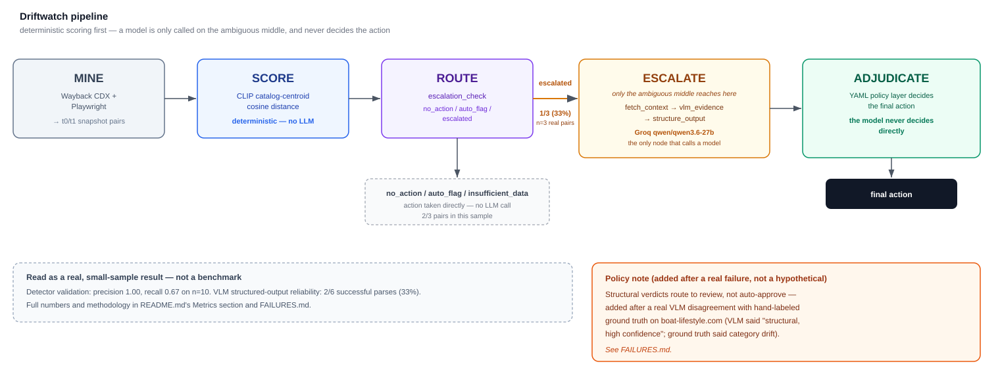

# Driftwatch

Driftwatch mines paired `t0`/`t1` snapshots of Indian merchant storefronts from
the Wayback Machine and produces a dataset for studying how a storefront
changes over time — category shifts, content rewrites, trust-signal changes,
structural redesigns, or no meaningful drift at all.

The dataset unit is a **pair**: two renders of the same homepage, separated by
enough time that a real business pivot could plausibly have happened, each
captured as a full-page screenshot plus rendered DOM.



## Pipeline

```
data/domains.txt  -->  scripts/mine_wayback.py  -->  data/pairs/<domain>/{t0,t1}
                                                  -->  evals/ (manual review)
```

1. **`scripts/mine_wayback.py`** queries the archive.org CDX API per domain,
   filters out non-content captures (parked pages, non-200s, truncated
   grabs), picks the widest-gap viable pair, and renders both sides through
   Playwright against the Wayback replay. A two-tier quality gate rejects
   renders with broken replay assets (>50% failed images) or no applied CSS,
   and flags — but does not reject — pairs with a low text/image retention
   ratio, since a merchant genuinely shrinking their catalogue looks the same
   as a half-loaded replay and both need a human to tell apart.
2. **`scripts/build_eyeball_review.py`** turns every successfully mined pair
   into one static HTML page: t0/t1 screenshots side by side, gap in days,
   and quality-gate flags on top, followed by a copy-pasteable CSV row for
   manual judgment.
3. Judgments are recorded by hand in **`evals/eyeball_notes.csv`**.

## Setup

```
pip install -r requirements.txt
playwright install chromium
```

For the drift detector (`drift/`, `evals/run_eval.py`), also install
`requirements-drift.txt` — see that file for the CLIP/BGE model dependencies
and the CPU-vs-GPU torch install note.

## Usage

Mine the full target list:

```
python scripts/mine_wayback.py data/domains.txt --collapse-digits 6 --cdx-limit 10000
```

Useful flags: `--only <domain>` to re-run a single domain, `--dry-run` for
CDX-only candidate selection with no browser, `--force` to re-mine a domain
already marked `ok`, `--max-gap-days` to cap the pair to a specific rescan
interval instead of the widest available gap. Every domain ends with exactly
one status written to `data/pairs/<domain>/status.json` and appended to
`data/mine_wayback_log.csv` — nothing fails silently.

Generate the review page after a run:

```
python scripts/build_eyeball_review.py --out evals/eyeball_review.html
```

Open the HTML file locally and fill in `evals/eyeball_notes.csv` as you go
(`domain,t0_date,t1_date,gap_days,what_changed,fits_axis,confidence,notes`).

## Data layout

```
data/
  domains.txt          target list — see the file header for bucket definitions
  cdx_cache/            cached CDX responses, keyed by domain (gitignored)
  pairs/<domain>/
    status.json          one terminal status per domain: ok, cdx_forbidden,
                          no_viable_captures, all_candidate_pairs_failed, ...
    t0/, t1/
      screenshot.png      full-page render
      dom.txt, dom.html   rendered text and HTML
      meta.json           timestamps, gap, quality metrics, review flags
  (pairs/, cdx_cache/, and the run log are gitignored — regenerate via the miner)
evals/
  eyeball_notes.csv     hand-filled manual review
  eyeball_review.html   generated viewer (gitignored, regenerate as needed)
```

## Target list

`data/domains.txt` holds ~50 Indian merchant domains across four buckets:

| Bucket | Count | Purpose |
|---|---|---|
| Small/mid D2C | 20 | Instagram-native / Shopify-lite storefronts likely to have decent Wayback coverage |
| Drift-prone | 10 | Nutraceutical/supplement D2C, lending-adjacent fintech, crypto — categories where real pivots happen |
| Stable control | 10 | Large established merchants, expected to show minimal drift |
| Buffer | 10 | Extra slots to absorb replay failures (JS-lazy-load pages, broken asset replay, etc.) |

## Drift detector (`drift/`)

Given a mined pair, `drift/` scores how much a storefront's catalog changed
between t0 and t1: `extract.py` pulls candidate product images and
catalog/nav text out of the render (with a usability gate that refuses a
side outright when its render was too broken to trust — see FAILURES.md),
`fetch.py` resolves image candidates to actual bytes, `embed.py` turns
images and text into vectors, and `score.py` reports the cosine distance
between t0 and t1 centroids. `evals/run_eval.py` validates both candidate
signals against hand-labeled ground truth in `evals/eyeball_notes.csv`.

**Validated result:** the image signal (CLIP catalog-image centroid) is the
detector — on 23 hand-labeled real pairs it separates 2 of 3 usable
category-drift positives cleanly from all 7 usable negatives (precision
1.00, recall 0.67 at best threshold, n=10). The text signal (BGE
catalog/nav-text centroid) was rejected: it measures how much a site's
text/nav footprint grew across a redesign, not whether its category
changed, and was dropped after clean structural-redesign negatives
outscored every category-drift positive. Full validation write-up,
including the two gate fixes that got the negative-example sample clean
enough to trust, is in `FAILURES.md`.

## Escalation agent (`adjudicate/`)

A LangGraph graph that decides what to do with a mined pair's drift score.
`escalation_check` routes on two configurable thresholds: below `LOW`
→ `no_action`, at/above `HIGH` → `auto_flag` (the precision=1.00 zone from
validation), in between → escalated to a VLM. A pair with no usable image
score at all (too few catalog images extracted) lands on a fourth outcome,
`insufficient_data`, rather than being silently folded into `no_action`.
Escalated pairs go through `fetch_context` (t0/t1 screenshots + a DOM text
diff), `vlm_evidence` (the only node that calls a model — currently
`qwen/qwen3.6-27b` on Groq; see that file's docstring for the model
substitution history), `structure_output` (schema validation, fails loudly,
never guesses a default), and `policy_adjudicate` (pure YAML rule lookup in
`adjudicate/policy.yaml` — the model never decides the action, only
describes evidence).

```
pip install -r requirements-adjudicate.txt
cp .env.example .env   # fill in GROQ_API_KEY
python -m adjudicate.run_test
```

**Real finding, not just plumbing:** the one documented boundary case
(boat-lifestyle.com) went through VLM escalation twice with two different
verdicts — the first disagreed with hand-labeled ground truth and would
have been auto-approved under the policy at the time. The policy was
changed in response (`structural` no longer auto-approves). Full story in
`FAILURES.md`.

## Metrics — measured on a small real sample, not a production-scale eval

Every number below is from an actual run of this pipeline (`adjudicate/logs/run_log.csv`,
`FAILURES.md`). The current figures are the **2026-08-27 full-batch run**: all 23
hand-labeled pairs in `evals/eyeball_notes.csv` through `drift/score.py` + the full
graph in one pass (`scripts/run_full_batch.py`), against the frozen system — no
threshold/prompt/policy/detector changes. n=10 still for the underlying detector
validation. Read this as "here's what really happened running the thing," not as a
benchmark result; the sample is small and the percentages are reported at that
resolution deliberately. The 3-pair figures this table used to carry are in
`FAILURES.md`'s history.

| Metric | Value | Basis |
|---|---|---|
| Merchant pairs run through the full pipeline | 23 | full `evals/eyeball_notes.csv` set; per-pair report in `adjudicate/logs/full_batch_summary.md` |
| Outcome distribution | `insufficient_data` 12 (52%), `parse_failed` 5 (22%), `no_action` 3 (13%), `auto_flag` 3 (13%), `escalated` 0 | only 11/23 pairs produced a usable deterministic score — the other 12 tripped `drift/extract.py`'s `broken_image_ratio > 0.3` gate |
| Escalation rate | 5/23 reached the VLM (22%); 5/11 of pairs with a usable score (45%) | escalation band 0.14–0.22: boat-lifestyle.com, timesofindia, dabur.com, dailyobjects.com, bankofbaroda.in |
| VLM reliability, this batch | **0/10 raw calls, 0/5 pipeline runs** | every call `400 json_validate_failed` on `qwen/qwen3.6-27b` (9 empty completion, 1 token-budget) — same failure modes as before, all at once |
| VLM reliability, cumulative per-call | **3 / 16 raw calls (19%)** | every VLM call recorded in `adjudicate/logs/run_log.csv` as it exists on disk (2026-08-24 → 2026-08-27, this batch included) — re-derivable from that file. This batch pulls the earlier 33% estimate down; the model's structured-output path is not dependable for any single pair |
| Cost / latency across escalated calls | $0.00 total; 35.3s–76.4s per pipeline escalation | Groq doesn't bill `json_validate_failed`; these are 2-attempt failure latencies, not the 5–6s a clean success took historically |
| Ground-truth disagreements | 3 | **hdfcbank.com** `auto_flag` on a clean bank redesign (false positive, score 0.2489 > HIGH); **wakefit.co** and **wellbeingnutrition.com** `insufficient_data` on real category pivots (misses, broken replay) — see `FAILURES.md` |
| Image-signal detector validation (CLIP catalog centroid) | precision 1.00, recall 0.67 | n=10 (3 category-drift positive, 7 negative), drawn from 23 hand-labeled pairs — accepted sample given time constraints, see `FAILURES.md` |
| VLM reliability, historical (prose only, not auditable) | 2/6 without retry (2026-08-22), 3/9 raw calls with retry (2026-08-23) | both predate the current `run_log.csv` — it was regenerated while building the console, so those rows are gone and these figures survive only as the write-up in `FAILURES.md`. Deliberately **not** summed with the 3/16 above; see that file for why |
| Parse-failure safety | verified, held under load | all 5 `parse_failed` pairs in the batch routed to `needs_manual_review` — logged, terminal, non-approving; zero pairs lost, zero defaulted to approve. See `FAILURES.md`. |

## Reproducing the demo

The console below reads real data, not fixtures: real mined Wayback pairs
under `data/pairs/` and a real logged agent run in `adjudicate/logs/run_log.csv`.
Both are gitignored and regenerated on purpose — but that means **regenerating
them from a truly fresh clone takes real time (mining hits the live Wayback
CDX API) and real money (the agent's escalated pairs are live Groq API
calls)**. Running `python scripts/build_console_data.py` before those exist
will not crash, but it will not produce a fully populated console either —
it's telling you the truth about what hasn't been run yet, not silently
faking data.

If you want to confirm the pipeline actually works end-to-end without
re-running it yourself: [`docs/sanity_check_2026-08-24.md`](docs/sanity_check_2026-08-24.md)
is a dated, section-by-section verification report (environment through
repo hygiene, including a real fresh-clone test and a live VLM call), and
[`docs/verification_screenshots/`](docs/verification_screenshots/) has the
actual screenshots from that run. Both are checked into the repo as
verifiable proof, not a claim to take on faith.

## Console (`console/`)

A minimal React + Vite + Tailwind demo console over `adjudicate/`'s output:
a sortable/filterable queue view, and a detail view with side-by-side
screenshots and the VLM's evidence packet. Static reads only — no backend —
so the data has to be assembled first:

```
python scripts/build_console_data.py   # joins adjudicate/logs/run_log.csv against
                                        # data/pairs/ and copies screenshots into
                                        # console/public/
cd console
npm install
npm run dev      # or: npm run build && npm run preview
```

Every row, including boat-lifestyle.com's, is derived straight from
`adjudicate/logs/run_log.csv` — there is no per-domain override in the build
script anymore (there used to be a hand-curated block pinning
boat-lifestyle.com to its earlier two-prompt-version escalation history; see
`FAILURES.md`). After the 2026-08-27 full-batch run boat-lifestyle.com shows
that run's real outcome (`parse_failed` → `needs_manual_review`) like every
other pair; the original prompt-version disagreement is documented in
`FAILURES.md`.

## Current dataset status

Latest full run against all 50 domains: **17 usable pairs**, 28 domains where
every candidate pair failed the render/quality gate, 2 CDX exclusions
(`cdx_forbidden`), and 3 domains with no viable candidate pair. A second
25-domain batch (large/established brands) added **6 more usable pairs**, for
**23 hand-labeled pairs** total in `evals/eyeball_notes.csv`. See
`data/mine_wayback_log.csv` for the per-domain breakdown and each domain's
`status.json` for the full attempt history.

All 23 have been run end-to-end through the adjudication graph (2026-08-27,
`scripts/run_full_batch.py`); outcomes in `adjudicate/logs/run_log.csv`,
per-pair report in `adjudicate/logs/full_batch_summary.md`, analysis in the
Metrics table above and `FAILURES.md`.
